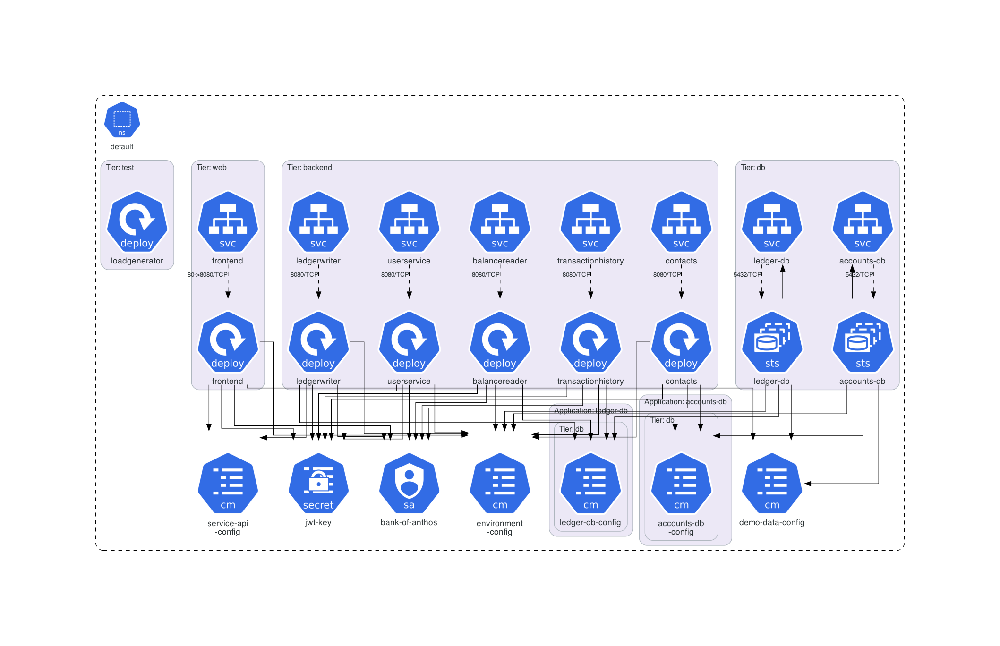
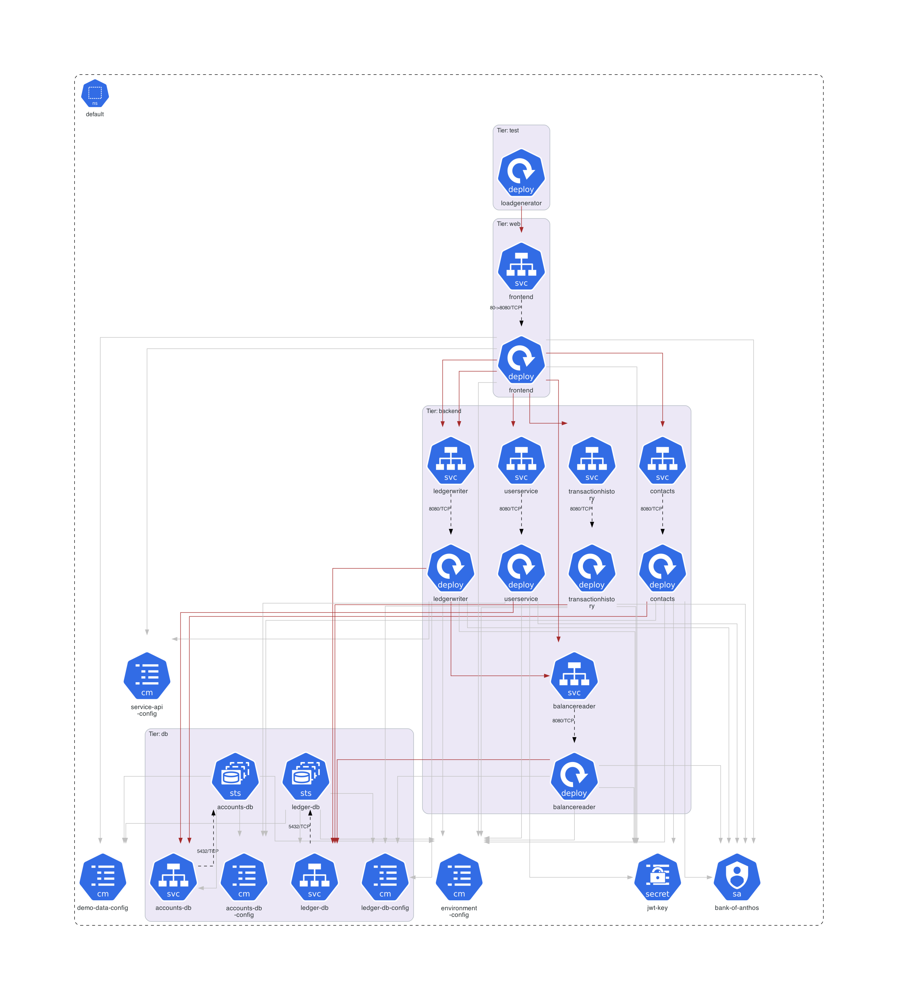
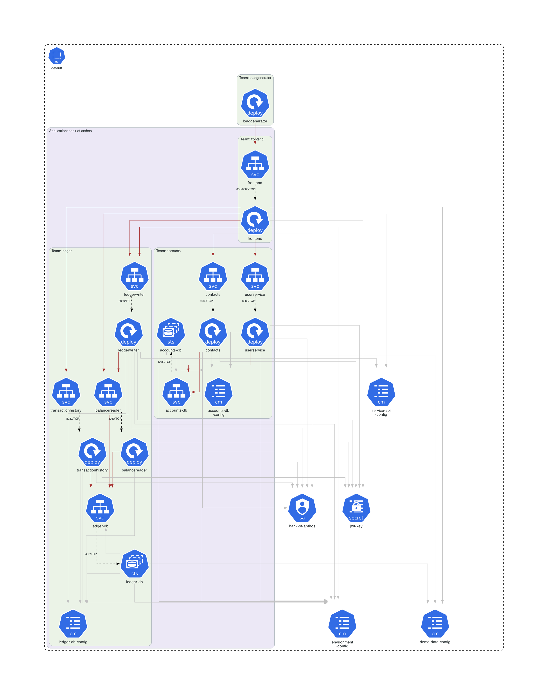

# Bank of Anthos Example

This example is dedicated to **[Google Cloud Platform's Bank of Anthos](https://github.com/GoogleCloudPlatform/bank-of-anthos/)**.

## Instructions

Generate the Kubernetes architecture diagrams:

```sh
./generate.sh
```

## Generated architecture diagrams

Architecture diagram for **[Google Cloud Platform's Bank of Anthos manifests](https://github.com/GoogleCloudPlatform/bank-of-anthos/tree/main/kubernetes-manifests)**:



Customized architecture diagram for **[Google Cloud Platform's Bank of Anthos manifests](https://github.com/GoogleCloudPlatform/bank-of-anthos/tree/main/kubernetes-manifests)**:



Another customized architecture diagram for **[Google Cloud Platform's Bank of Anthos manifests](https://github.com/GoogleCloudPlatform/bank-of-anthos/tree/main/kubernetes-manifests)**:


