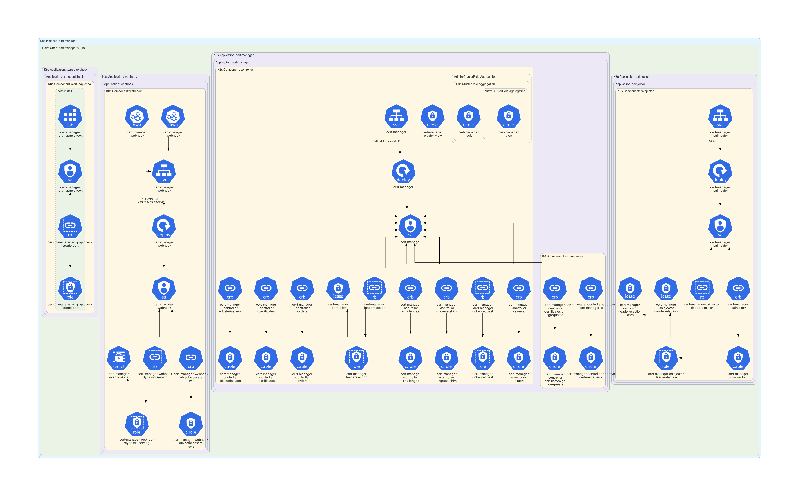
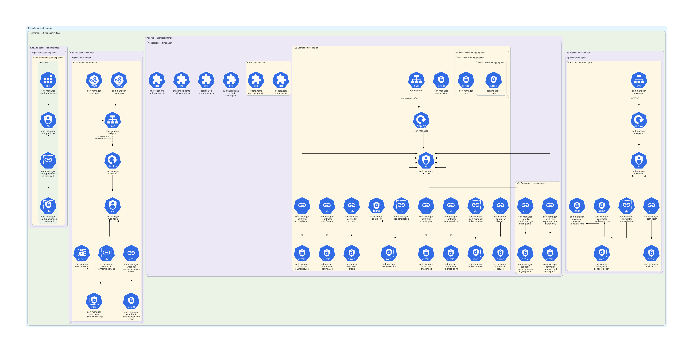
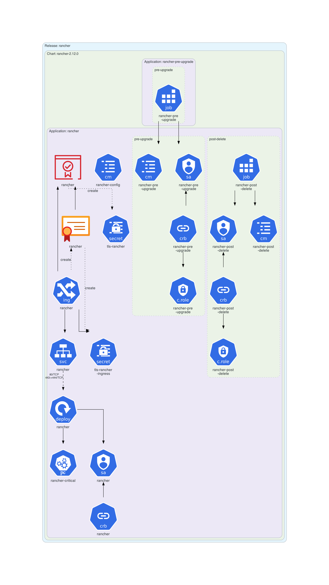
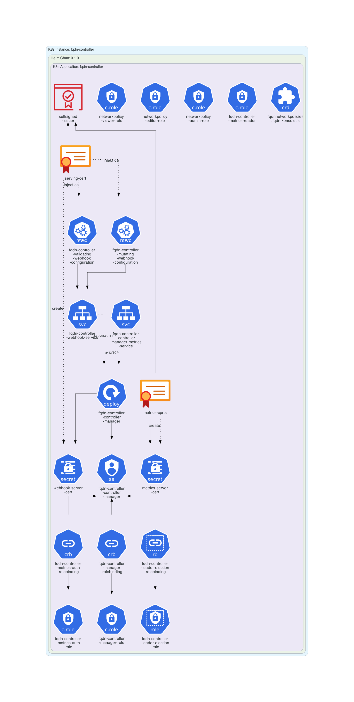
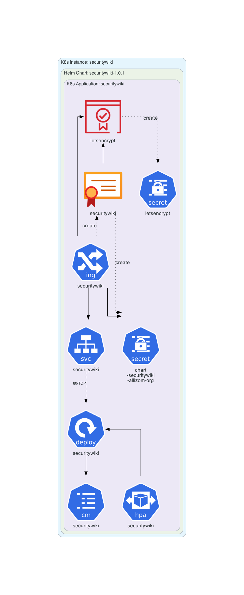
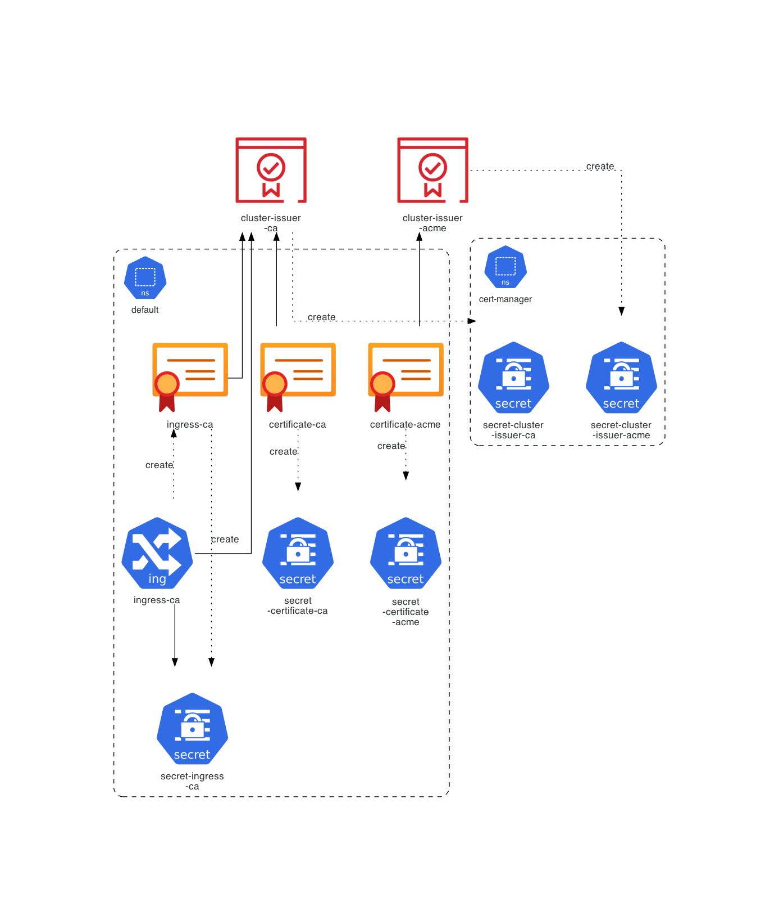

# `cert-manager` Example

This example is dedicated to **[cert-manager](https://cert-manager.io/)** example.

## Instructions

Generate the Kubernetes architecture diagrams for **[cert-manager](https://cert-manager.io/)** example:

```sh
$ generate.sh
```

## Generated architecture diagrams

Architecture diagram for **[cert-manager](https://cert-manager.io/)** Helm Chart:



Architecture diagram for **[cert-manager](https://cert-manager.io/)** Helm Chart including CRDs:



Architecture diagram for **[Rancher Helm Chart](https://artifacthub.io/packages/helm/rancher-stable/rancher)** using `cert-manager`:



Architecture diagram for **[FQDN Controller Helm Chart](https://artifacthub.io/packages/helm/fqdn-controller/fqdn-controller)** using `cert-manager`:



Architecture diagram for **[Mozilla securitywiki](manifests/mozilla-securitywiki.yaml)** using `cert-manager`:



Architecture diagram for **[ClusterIssuer resources](manifests/cluster-issuers.yaml)**:


