# DeathStarBench Example

This example is dedicated to **[DeathStarBench](https://github.com/delimitrou/DeathStarBench)** example.

## Instructions

Generate the Kubernetes architecture diagrams for **[DeathStarBench](https://github.com/delimitrou/DeathStarBench)** example:

```sh
$ generate.sh
```

## Generated architecture diagrams

### Hotel Reservation Application

Architecture diagram for **[Hotel Reservation Helm Chart](https://github.com/delimitrou/DeathStarBench/tree/master/hotelReservation/helm-chart/hotelreservation)**:

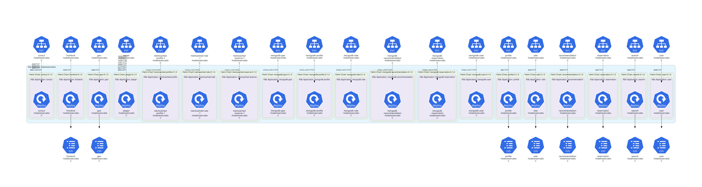

Architecture diagram for **[Hotel Reservation Knative manifests](https://github.com/delimitrou/DeathStarBench/tree/master/hotelReservation/knative)**:

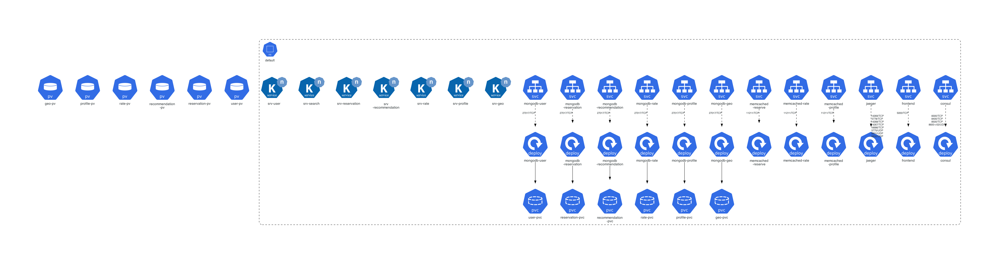

Customized architecture diagram for **[Hotel Reservation Knative manifests](https://github.com/delimitrou/DeathStarBench/tree/master/hotelReservation/knative)**:

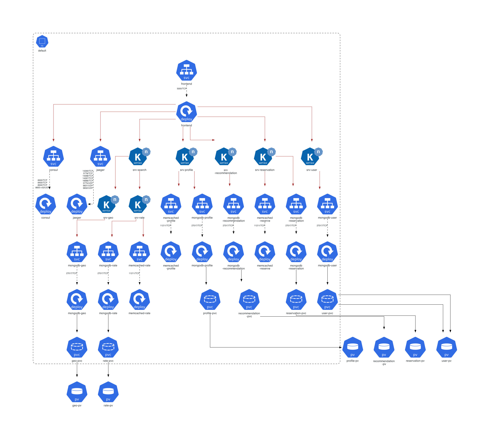

Architecture diagram for **[Hotel Reservation Kubernetes manifests](https://github.com/delimitrou/DeathStarBench/tree/master/hotelReservation/kubernetes)**:

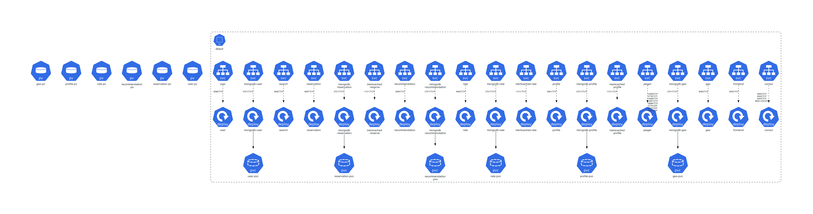

Customized architecture diagram for **[Hotel Reservation Kubernetes manifests](https://github.com/delimitrou/DeathStarBench/tree/master/hotelReservation/kubernetes)**:

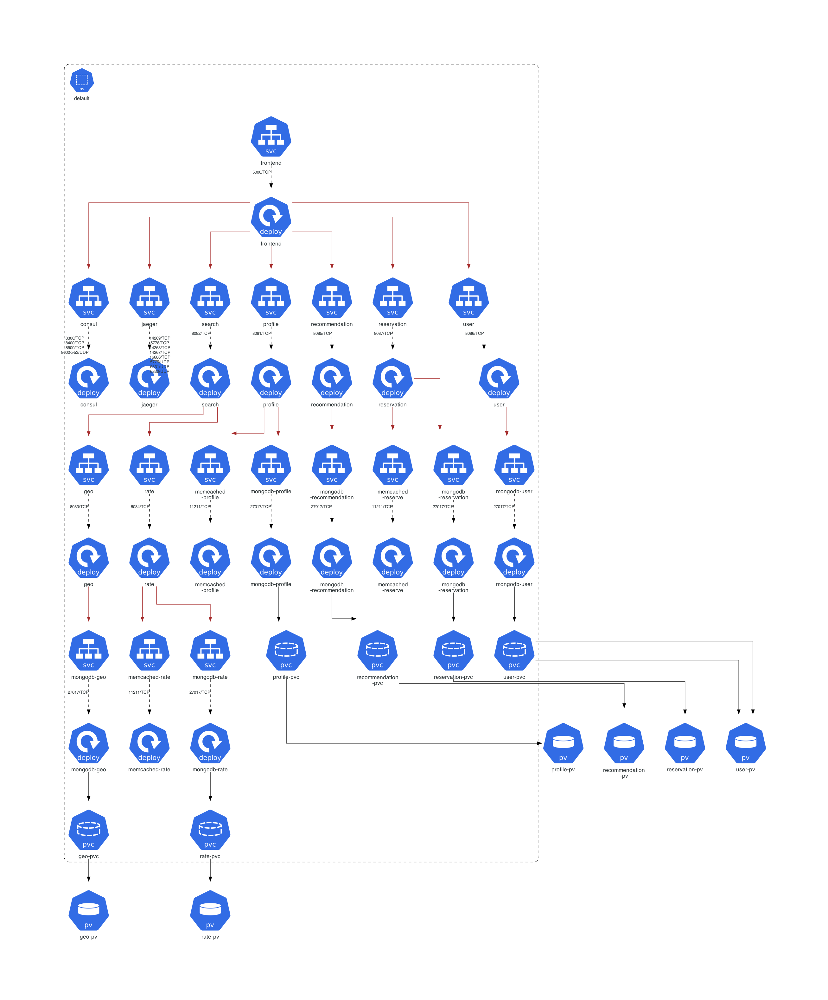

Architecture diagram for **[Hotel Reservation OpenShift manifests](https://github.com/delimitrou/DeathStarBench/tree/master/hotelReservation/openshift)**:

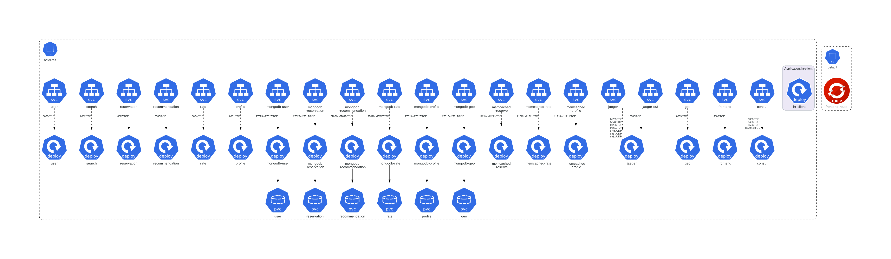

Customized architecture diagram for **[Hotel Reservation OpenShift manifests](https://github.com/delimitrou/DeathStarBench/tree/master/hotelReservation/openshift)**:

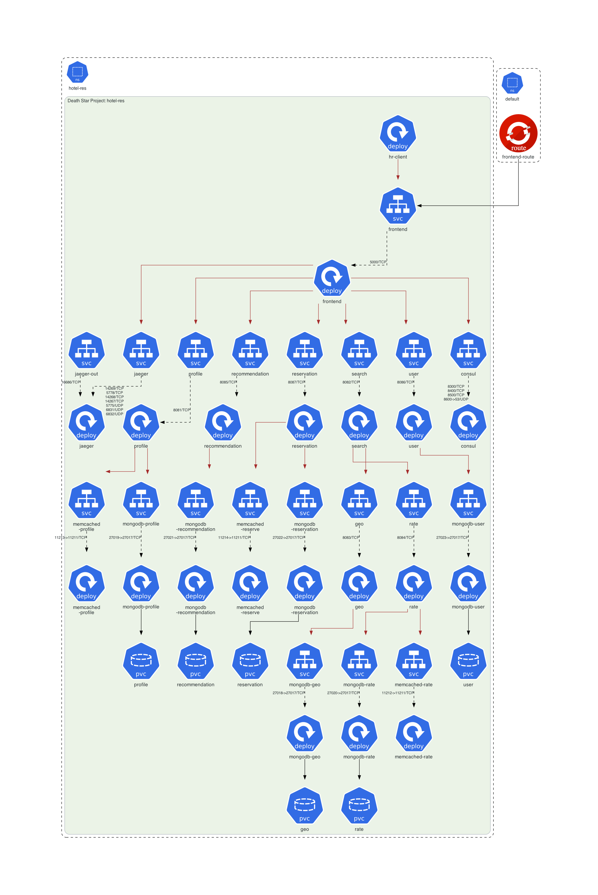

### Media Microservices Application

Architecture diagram for **[Media Microservices Helm Chart](https://github.com/delimitrou/DeathStarBench/tree/master/mediaMicroservices/helm-chart/mediamicroservices)**:

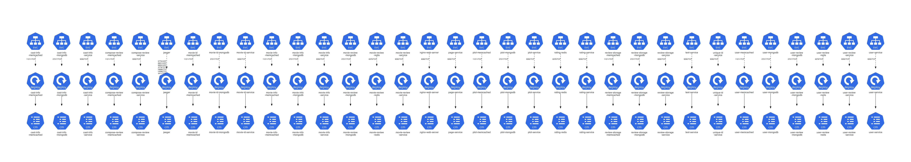

Architecture diagram for **[Media Microservices OpenShift manifests](https://github.com/delimitrou/DeathStarBench/tree/master/mediaMicroservices/openshift)**:

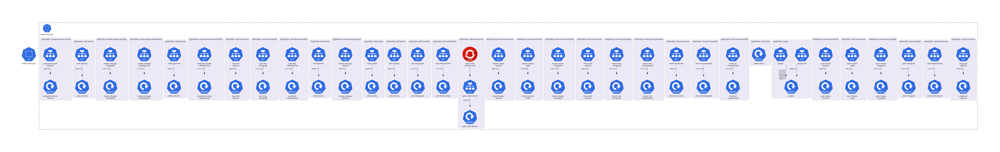

### Social Network Application

Architecture diagram for **[Social Network Helm Chart](https://github.com/delimitrou/DeathStarBench/tree/master/socialNetwork/helm-chart/socialnetwork)**:

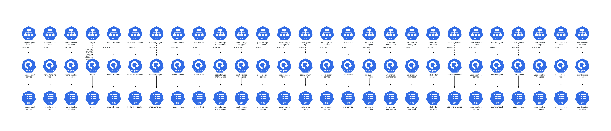

Architecture diagram for **[Social Network OpenShift manifests](https://github.com/delimitrou/DeathStarBench/tree/master/socialNetwork/openshift)**:

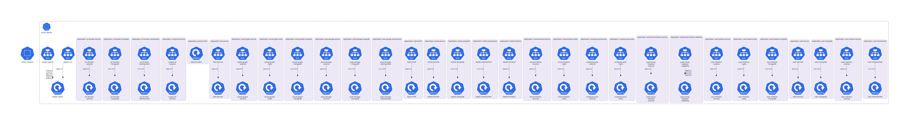
