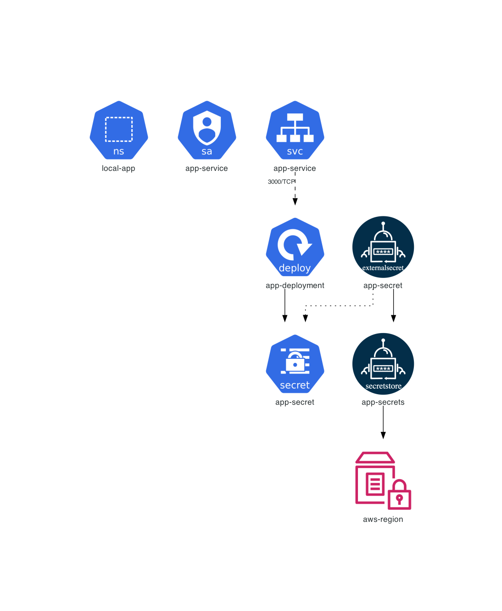

# External Secrets Operator Example

This example is dedicated to **[External Secrets Operator](https://external-secrets.io/)**.

## Instructions

Generate the Kubernetes architecture diagrams for **[External Secrets Operator](https://external-secrets.io/)**:

```sh
$ generate.sh
```

## Generated architecture diagrams

Architecture diagram for **[External Secrets Operator](https://external-secrets.io/)** Helm Chart:


Architecture diagram for **[Hazelops Web Helm Chart](https://artifacthub.io/packages/helm/hazelops/web)** using **[External Secrets Operator](https://external-secrets.io/)**:



Architecture diagram for **[Helmingapp Myapp Helm Chart](https://artifacthub.io/packages/helm/helmingapp/myapp)** using **[External Secrets Operator](https://external-secrets.io/)**:


Architecture diagram for **[create-databases/job-database Helm Chart](https://artifacthub.io/packages/helm/create-databases/job-database)** using **[External Secrets Operator](https://external-secrets.io/)**:


