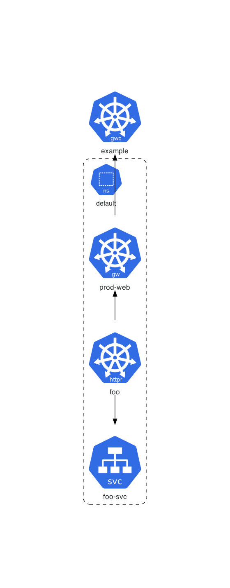
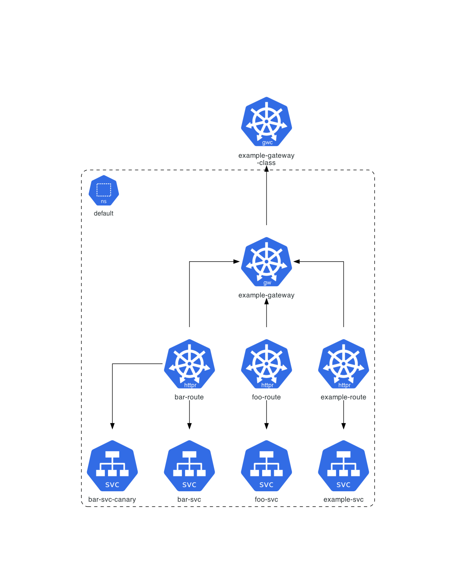
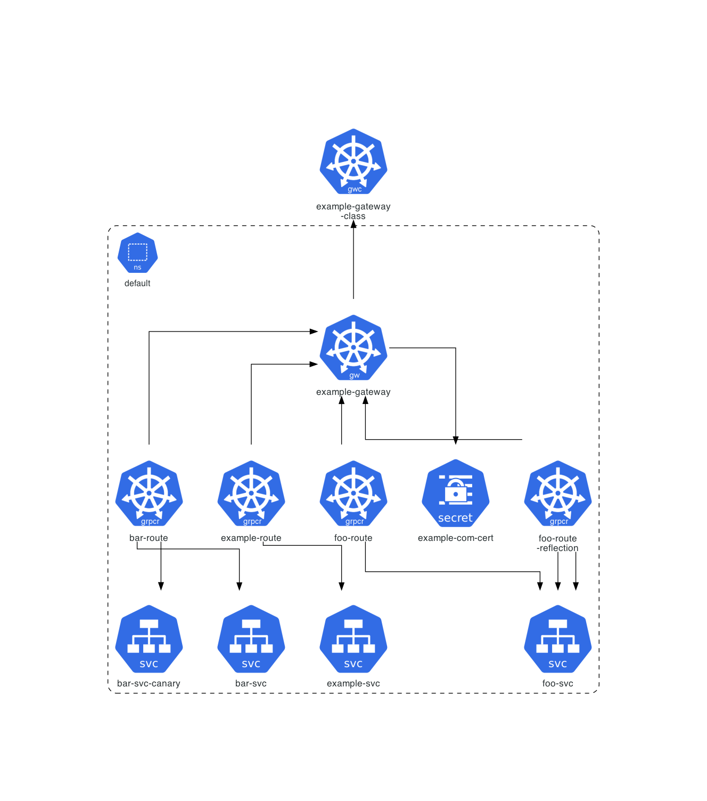
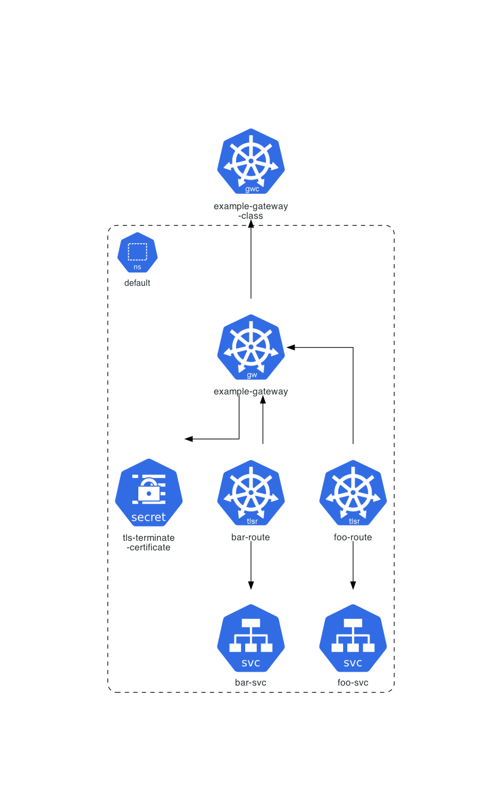
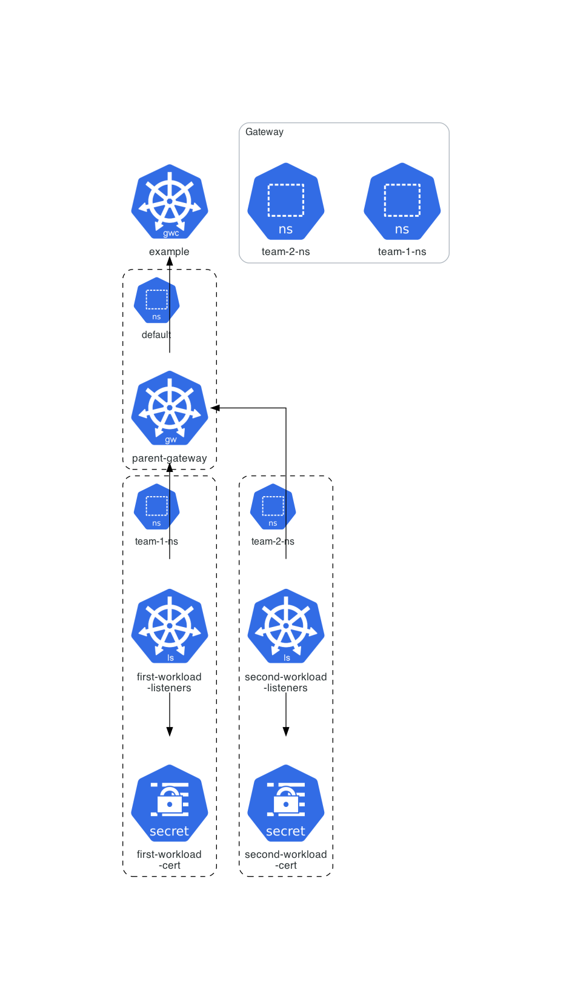

# Gateway API Example

This example is dedicated to **[Gateway API](https://gateway-api.sigs.k8s.io)**.

## Supported Gateway Resources

|               Kind               |            ApiGroup            |           Versions            |                                                                          Icon                                                                          |
| :------------------------------: | :----------------------------: | :---------------------------: | :----------------------------------------------------------------------------------------------------------------------------------------------------: |
|           `BackendTLSPolicy`           |    `gateway.networking.k8s.io`    |        `v1`         |                                    |
|           `Gateway`           |    `gateway.networking.k8s.io`    |        `v1`         |                                    |
|           `GatewayClass`           |    `gateway.networking.k8s.io`    |        `v1`         |                                    |
|           `GRPCRoute`           |    `gateway.networking.k8s.io`    |        `v1`         |                                    |
|           `HTTPRoute`           |    `gateway.networking.k8s.io`    |        `v1`         |                                    |
|           `ListenerSet`           |    `gateway.networking.k8s.io`    |        `v1`         |                                    |
|           `ReferenceGrant`           |    `gateway.networking.k8s.io`    |        `v1`         |                                    |
|           `TLSRoute`           |    `gateway.networking.k8s.io`    |        `v1`         |                                    |

## Instructions

Generate the Kubernetes architecture diagrams for Gateway API examples available [here](manifests/):
```sh
$ ./generate.sh
```

## Generated architecture diagrams

Architecture diagram for the [simple gateway](manifests/standard/simple-gateway/) example:



Architecture diagram for the [HTTP routing](manifests/standard/http-routing/) example:



Architecture diagram for the [GRPC routing](manifests/standard/grpc-routing/) example:



Architecture diagram for the [TLS routing](manifests/standard/tls-routing/) example:



Architecture diagram for the [listenerset](manifests/standard/listenerset/) example:



All other generated diagrams are available [here](diagrams/).
