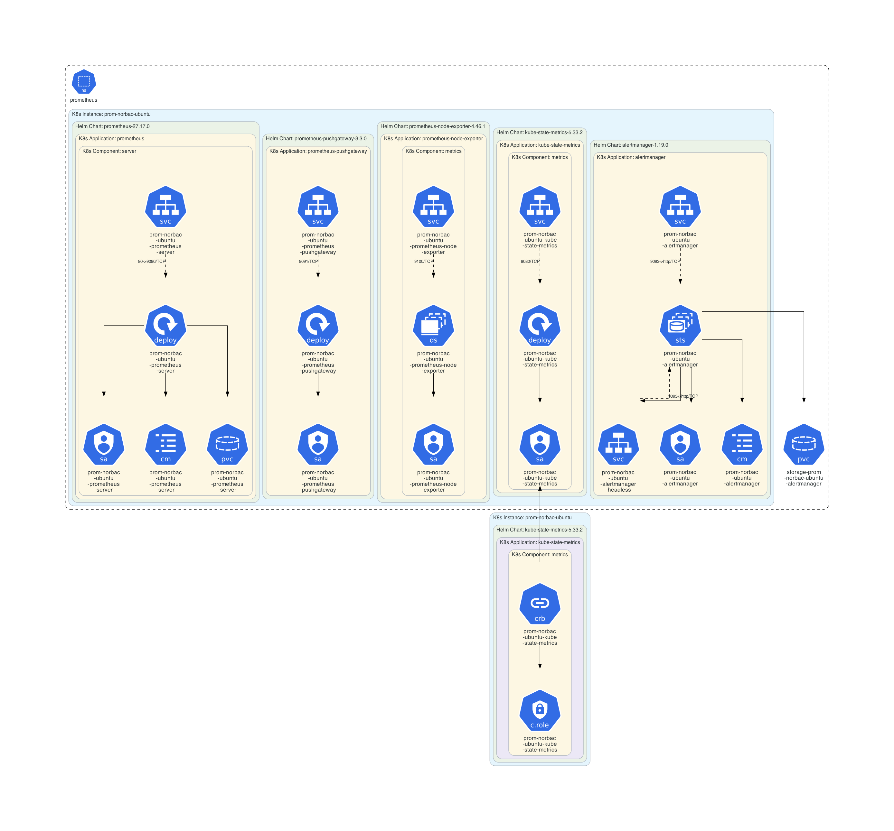

# Helmfile Example

This example illustrates how using **KubeDiagrams** with  **[helmfile](https://github.com/helmfile/helmfile)**.

## Instructions

Generate the Kubernetes architecture diagram for [helmfile.yaml](helmfile.yaml):

```sh
$ helmfile template -f helmfile.yaml | kube-diagrams - -o helmfile.png
```
## Generated architecture diagrams

Architecture diagram for [helmfile.yaml](helmfile.yaml):

