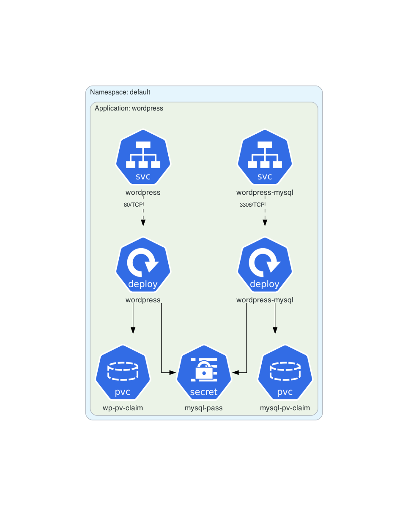
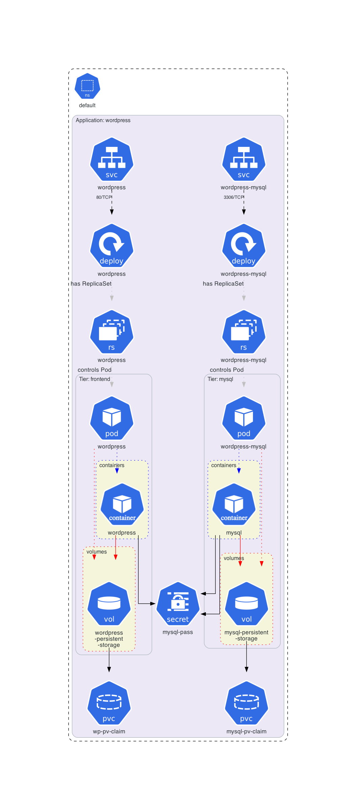
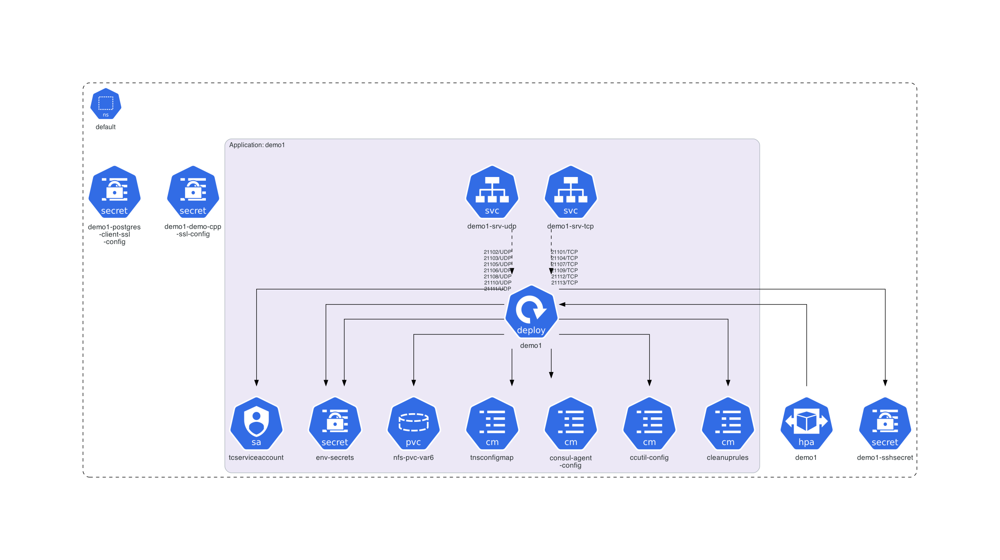
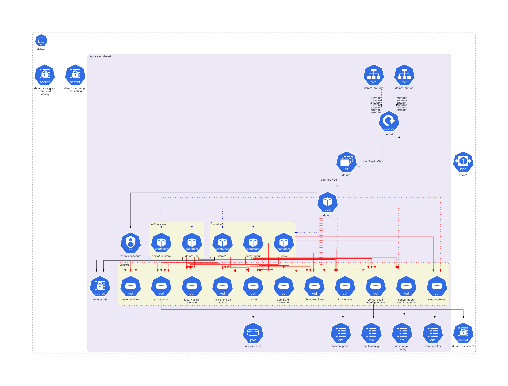
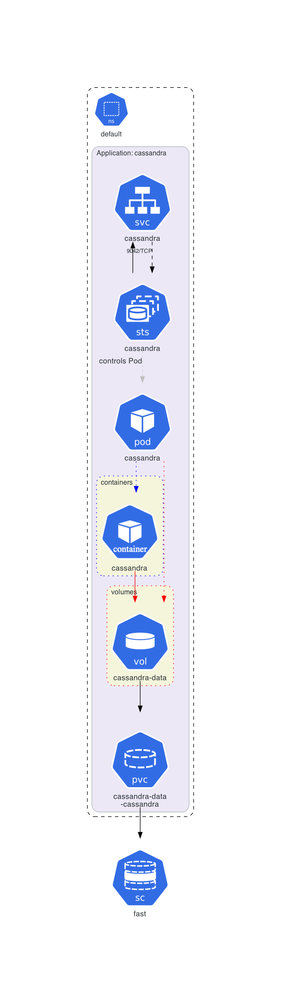

# Inside Workloads Example

This example illustrates how to show the internal structure of workloads, i.e., their pods, volumes, containers, mounted volumes, referenced config maps and secrets, as discussed [here](https://github.com/philippemerle/KubeDiagrams/discussions/52).

## Instructions

Generate the Kubernetes architecture diagrams:

```sh
./generate.sh
```

## Generated architecture diagrams

By default, with **KubeDiagrams**, each workload is represented by one graphical node as shown in the following diagram containing two deployments:



But sometimes, we would like to see the internal structure of workloads, i.e., their pods, volumes, containers, mounted volumes, and how config maps, secrets, and persistent volume claims are referenced.

Following diagram shows the internal structure of both deployments of this [WordPress example](../wordpress/):



Following diagram shows the architecture of a [demo example](manifests/demo1_with_srv.yaml):



Following diagram shows the internal structure of the deployment of this demo example:



This previous diagram shows that sometimes the internal structure of workloads can be strongly complex.

Moreover, this could be interesting to see the internal structure of `StatefulSet` workloads like that of the [Cassandra example](../cassandra/)



The **KubeDiagrams** configuration to show the internal structure of workloads is available in [inside-workloads.kdc](inside-workloads.kdc) and could be used as following:

```sh
kube-diagrams -c inside-workloads.kdc <your manifests>
```

or

```sh
helm-diagrams -c inside-workloads.kdc <URL of your Helm chart>
```
