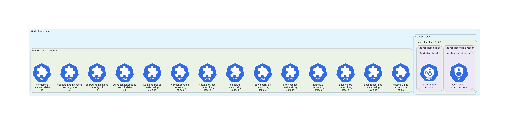
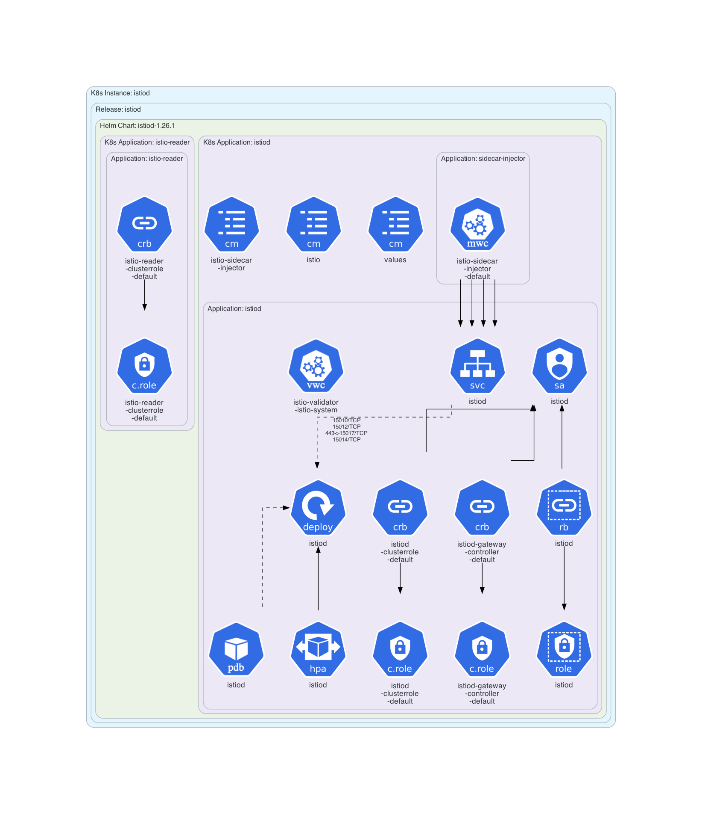
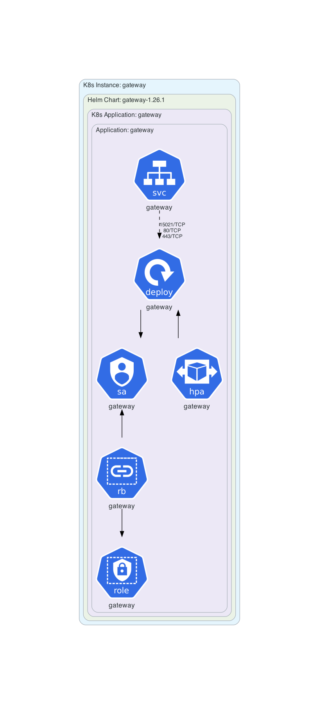
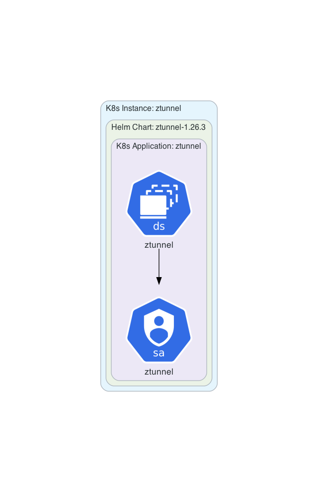
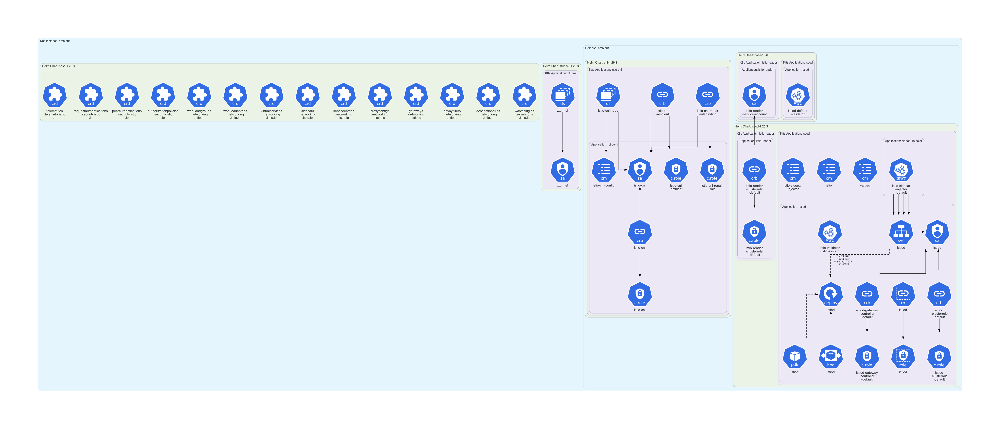
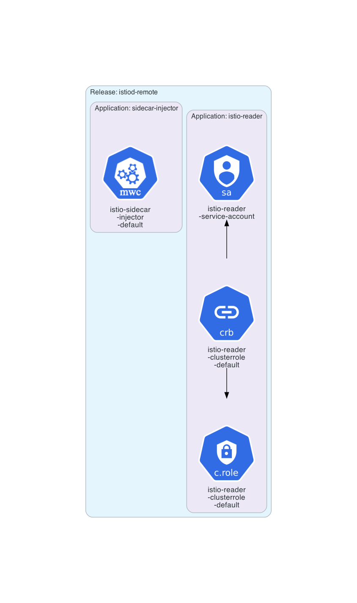
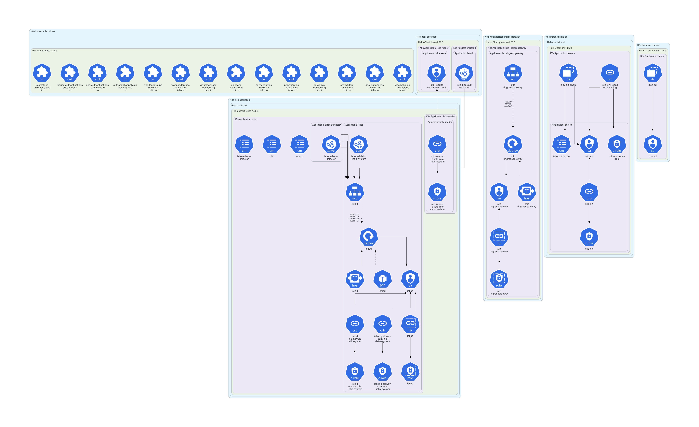
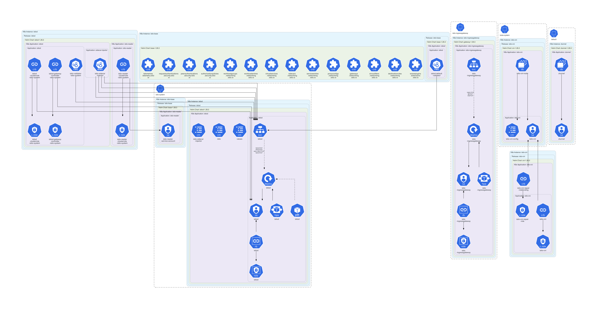
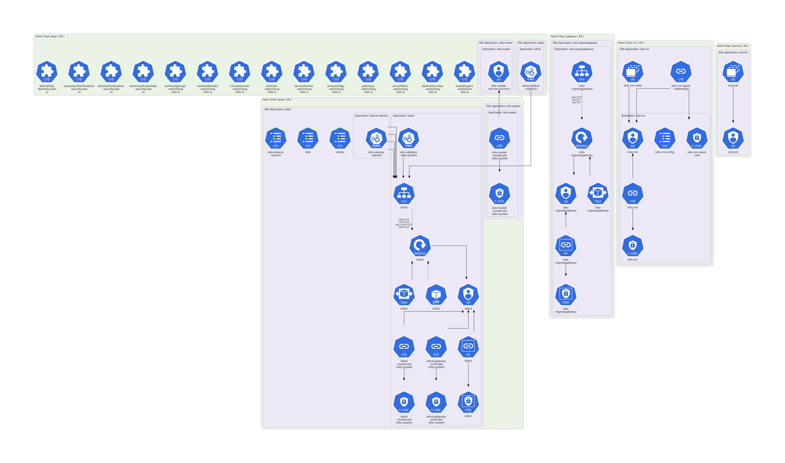

# Istio Example

This example is dedicated to **[Istio](https://istio.io)**.

## Instructions

Generate the Kubernetes architecture diagrams for Istio Helm charts and helmfile:
```sh
$ ./generate.sh
```

## Generated architecture diagrams

Architecture diagram for [Istio base Helm Chart](https://artifacthub.io/packages/helm/istio-official/base):



Architecture diagram for [Istiod Helm Chart](https://artifacthub.io/packages/helm/istio-official/istiod):



Architecture diagram for [Istio Gateway Helm Chart](https://artifacthub.io/packages/helm/istio-official/gateway):



Architecture diagram for [Istio CNI Helm Chart](https://artifacthub.io/packages/helm/istio-official/cni):


Architecture diagram for [Istio Ztunnel Helm Chart](https://artifacthub.io/packages/helm/istio-official/ztunnel):



Architecture diagram for [Istio Ambient Helm Chart](https://artifacthub.io/packages/helm/istio-official/ambient):



Architecture diagram for [Istiod Remote Helm Chart](https://artifacthub.io/packages/helm/istio-official/istiod-remote):



Architecture diagram for [istio-all.yaml helmfile](istio-all.yaml):



Architecture diagram for [istio-all.yaml helmfile](istio-all.yaml) with all namespaces:



Architecture diagram for [istio-all.yaml helmfile](istio-all.yaml) with focus on all Helm charts:



Architecture diagram for [istio-all.yaml helmfile](istio-all.yaml) with focus on all application clusters:


