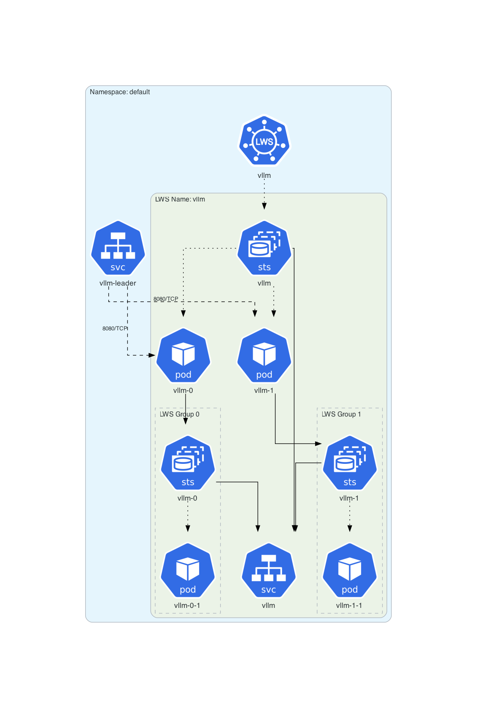
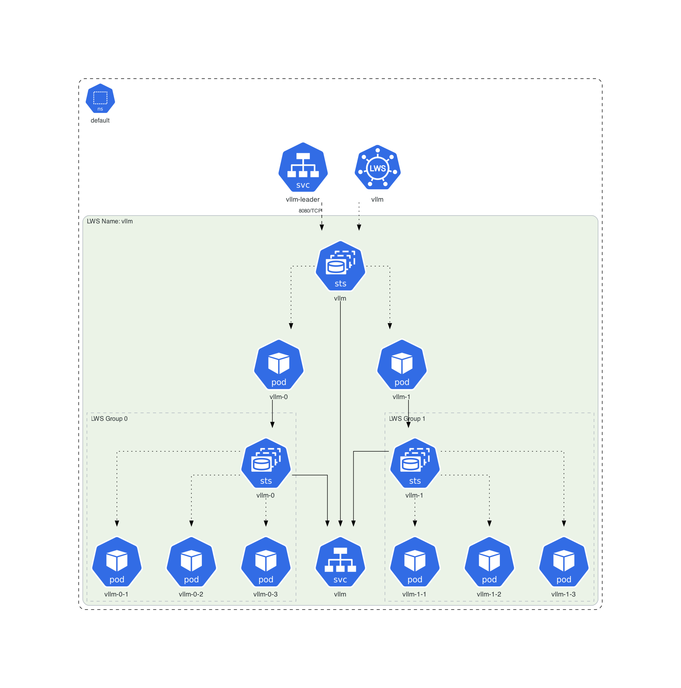
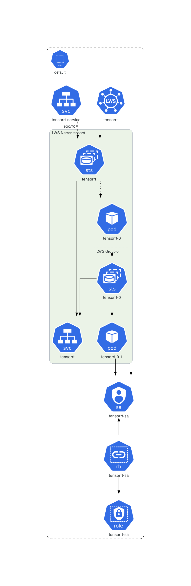
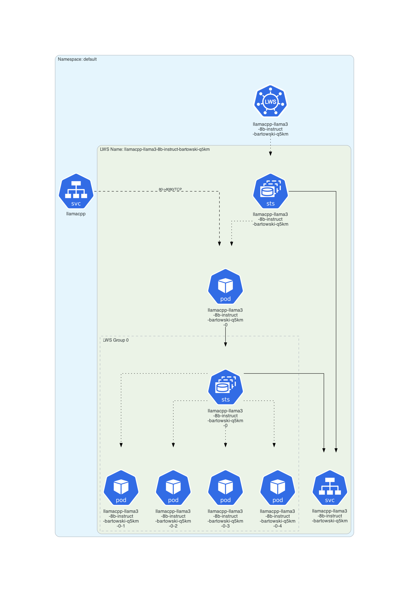
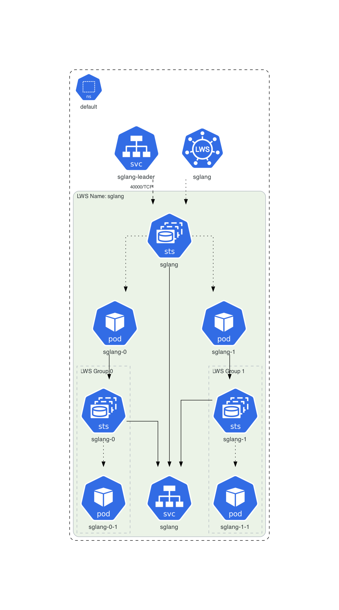
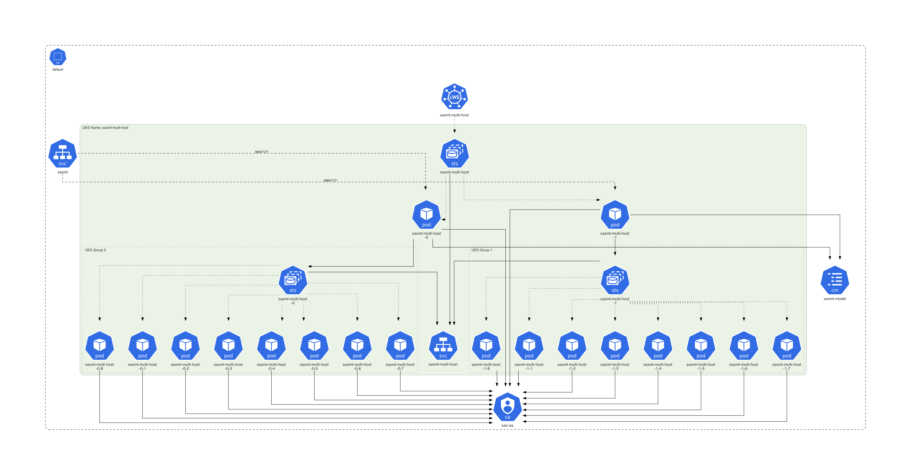
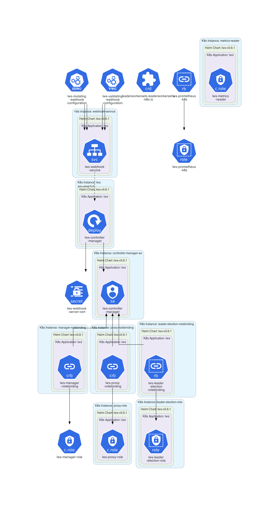

# LeaderWorkerSet API Example

This example is dedicated to **[LeaderWorkerSet API](https://lws.sigs.k8s.io)**.

## Instructions

Generate the Kubernetes architecture diagrams for LeaderWorkerSet API and its examples:
```sh
$ ./generate.sh
```

## Generated architecture diagrams

Architecture diagram for the [vLLM example with GPU](https://lws.sigs.k8s.io/docs/examples/vllm/):



Architecture diagram for the [vLLM example with TPU](https://lws.sigs.k8s.io/docs/examples/vllm/):



Architecture diagram for the [TensorRT-LLM example](https://lws.sigs.k8s.io/docs/examples/tensorrt-llm/):



Architecture diagram for the [llama.cpp example](https://lws.sigs.k8s.io/docs/examples/llamacpp/):



Architecture diagram for the [SGLang example](https://lws.sigs.k8s.io/docs/examples/sglang/):



Architecture diagram for the [Saxml example](https://lws.sigs.k8s.io/docs/examples/saxml/):



Architecture diagram for LeaderWorkerSet operator:

