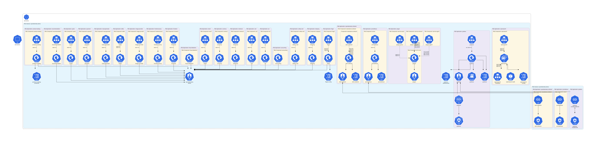
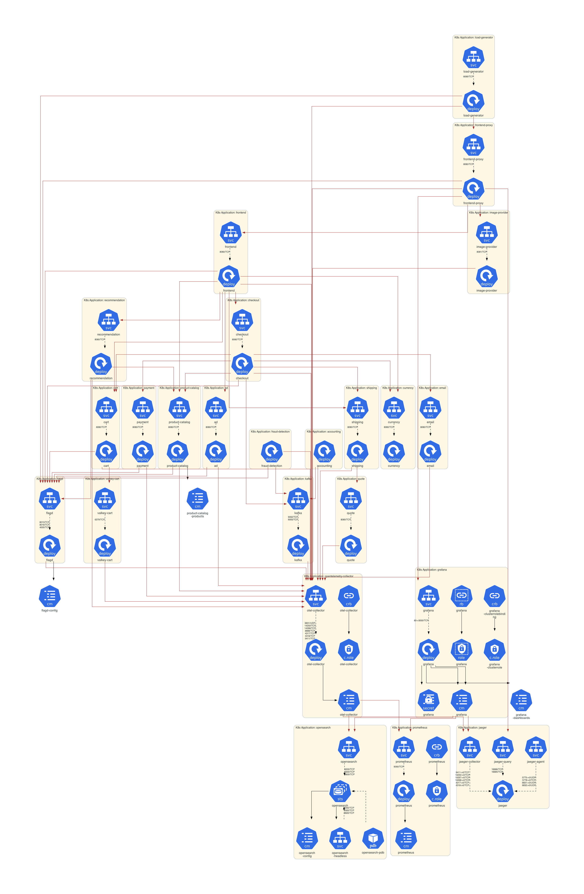
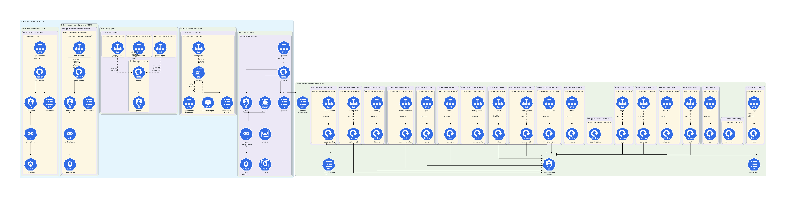

# OpenTelemetry Demo Example

This example is dedicated to **[OpenTelemetry Demo](https://github.com/open-telemetry/opentelemetry-demo/)**.

## Instructions

Generate the Kubernetes architecture diagrams:

```sh
./generate.sh
```

## Generated architecture diagrams

Architecture diagram for **[OpenTelemetry Demo Manifest](https://github.com/open-telemetry/opentelemetry-demo/blob/main/kubernetes/opentelemetry-demo.yaml)**:



Customized architecture diagram for **[OpenTelemetry Demo Manifest](https://github.com/open-telemetry/opentelemetry-demo/blob/main/kubernetes/opentelemetry-demo.yaml)**:



Architecture diagram for **[OpenTelemetry Demo Helm Chart](https://artifacthub.io/packages/helm/opentelemetry-helm/opentelemetry-demo)**:


