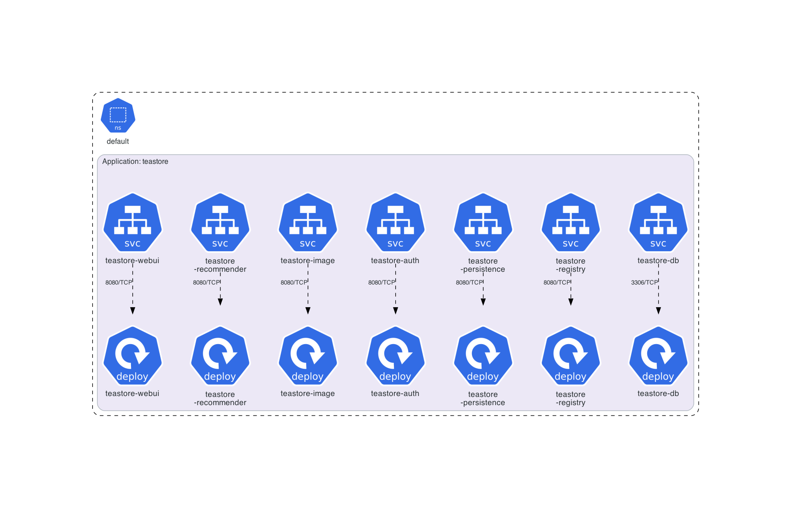
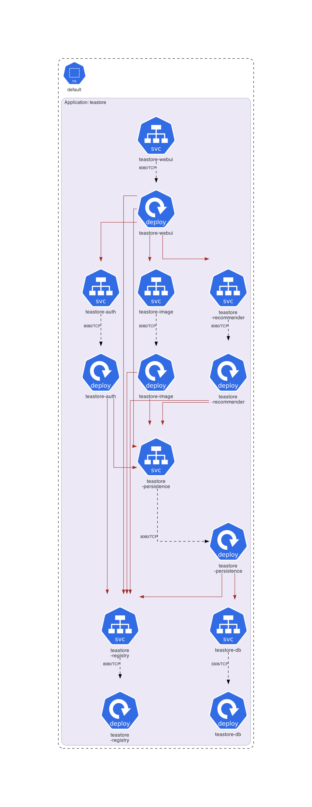
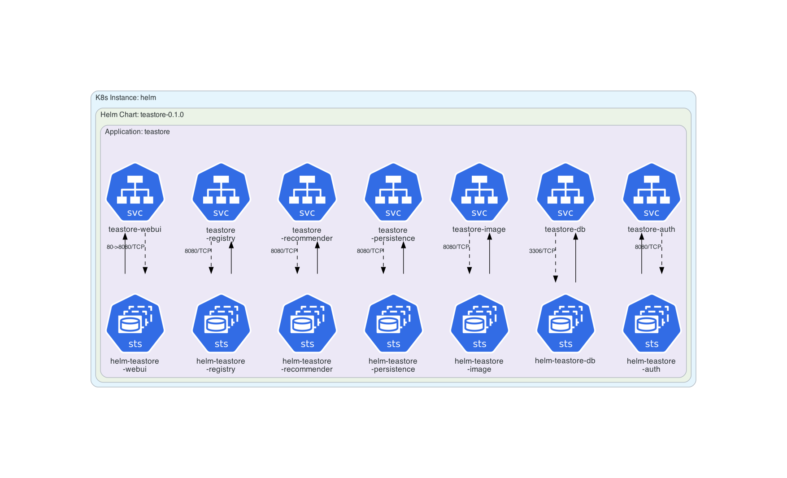
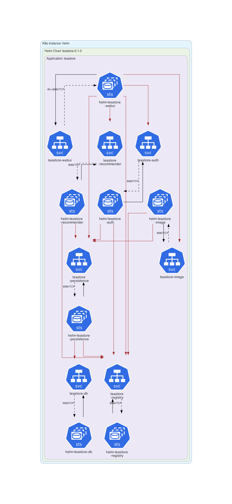

# TeaStore Example

This example is dedicated to **[TeaStore](https://github.com/DescartesResearch/TeaStore)** example.

## Instructions

Generate the Kubernetes architecture diagrams for **[TeaStore](https://github.com/DescartesResearch/TeaStore)** example:

```sh
$ generate.sh
```

## Generated architecture diagrams

Architecture diagram for **[TeaStore manifests](https://github.com/DescartesResearch/TeaStore/tree/master/examples/kubernetes)**:



Customized architecture diagram for **[TeaStore manifests](https://github.com/DescartesResearch/TeaStore/tree/master/examples/kubernetes)**:



Architecture diagram for **[TeaStore Helm Chart](https://github.com/DescartesResearch/TeaStore/tree/master/examples/helm)**:



Customized architecture diagram for **[TeaStore Helm Chart](https://github.com/DescartesResearch/TeaStore/tree/master/examples/helm)**:


