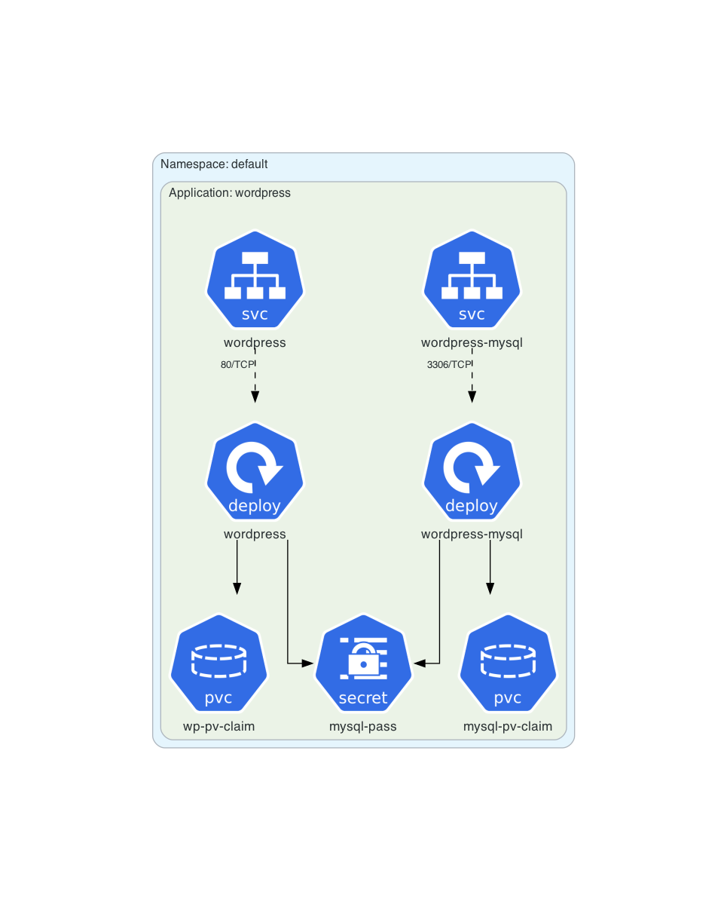
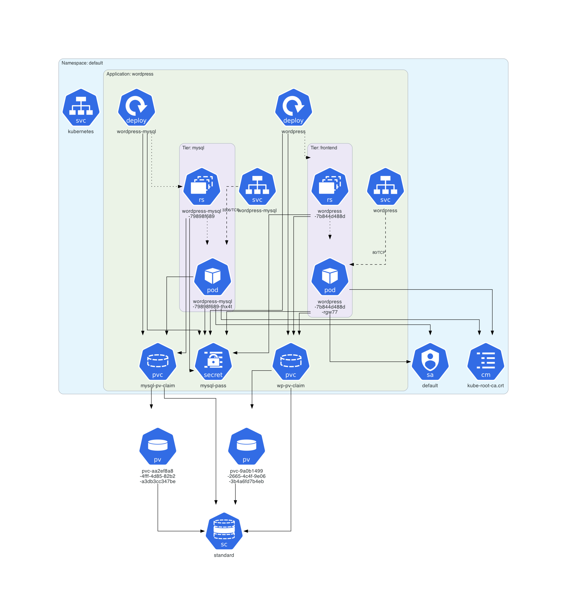
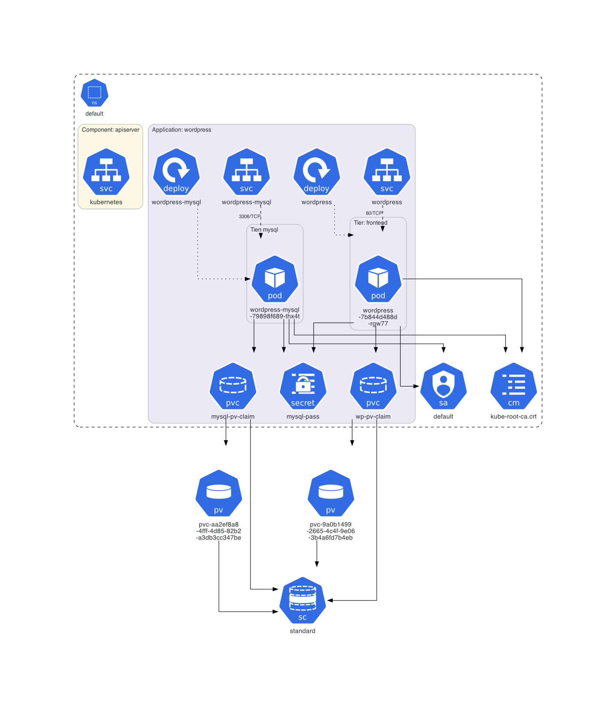
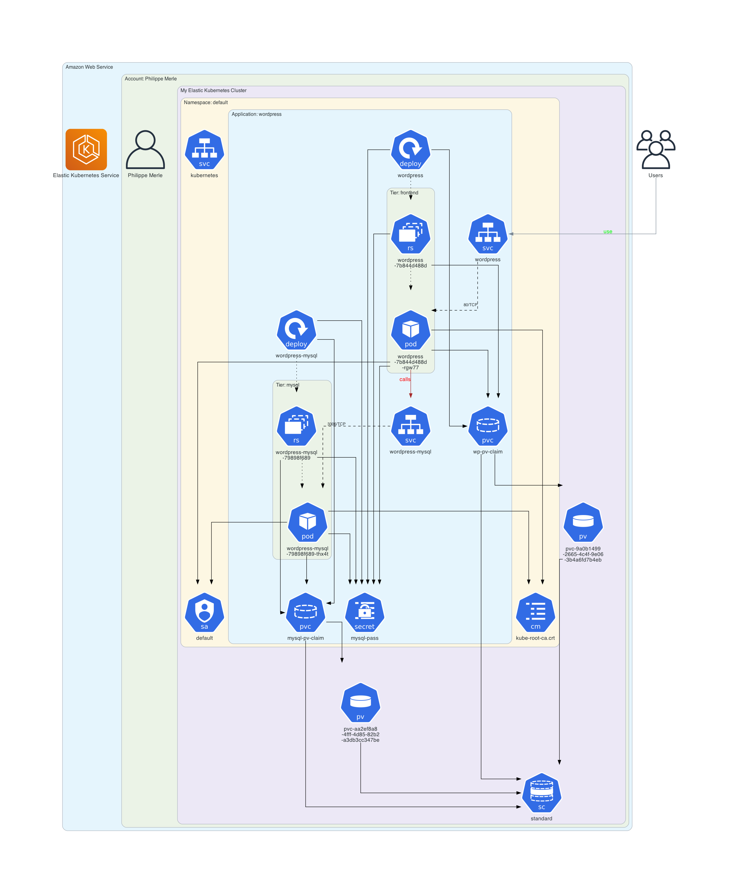

# WordPress Example

This example is based on the **[official Kubernetes WordPress tutorial](https://kubernetes.io/docs/tutorials/stateful-application/mysql-wordpress-persistent-volume/)**.

## Instructions

Generate the Kubernetes architecture diagram for WordPress manifests:
```sh
$ kube-diagrams -o wordpress *.yaml
```

Start a minikube cluster:
```sh
$ minikube start --memory 5120 --cpus=4
```

Deploy the WordPress application:
```sh
$ kubectl apply -f mysql-pass.yaml
$ kubectl apply -f mysql-deployment.yaml
$ kubectl apply -f wordpress-deployment.yaml
```

Wait a few minutes for the WordPress application to be deployed.

Get all Kubernetes resources in the `default` namespace:
```sh
$ kubectl get all,sa,cm,secret,pvc,pv,sc -o=yaml > namespace_default.yml
```

Generate a Kubernetes architecture diagram for the `default` namespace:
```sh
$ kube-diagrams namespace_default.yml
```

Generate a Kubernetes architecture diagram for the `default` namespace but hide ReplicaSet objects:
```sh
$ kube-diagrams -c hide_replicaset.kd -o namespace_default_without_replicaset.png namespace_default.yml
```

Delete the WordPress application:
```sh
$ kubectl delete -f wordpress-deployment.yaml
$ kubectl delete -f mysql-deployment.yaml
$ kubectl delete -f mysql-pass.yaml
```
Generate a custom diagram where the WordPress application is deployed in AWS EKS.
```sh
$ kube-diagrams -c custom_diagram.kd -o wordpress_deployed_in_aws_eks namespace_default.yml
```

## Generated architecture diagrams

Architecture diagram for WordPress manifests:


D2 diagram for WordPress manifests:


Mermaid diagram for WordPress manifests:
```mermaid
flowchart TB
  subgraph cluster_Namespace_default [Namespace: default]
    direction TB
    style cluster_Namespace_default fill:white,color:#2D3436,font:sans-serif,font-size:12pt,stroke:black,stroke-dasharray:7 7
    subgraph cluster_Application_wordpress [Application: wordpress]
      direction TB
      style cluster_Application_wordpress fill:#ECE8F6,color:#2D3436,font:sans-serif,font-size:12pt,stroke:#AEB6BE
      216e17e905a74ecab47679c7e9f78366@{ img: "https://raw.githubusercontent.com/mingrammer/diagrams/refs/heads/master/resources/k8s/network/svc.png", label: "wordpress-mysql", h: 120, constraint: "on" }
      style 216e17e905a74ecab47679c7e9f78366 fill:none,stroke:none
      3fb470b48c5245ee828fe4eee608156c@{ img: "https://raw.githubusercontent.com/mingrammer/diagrams/refs/heads/master/resources/k8s/compute/deploy.png", label: "wordpress-mysql", h: 120, constraint: "on" }
      style 3fb470b48c5245ee828fe4eee608156c fill:none,stroke:none
      2beb29e6801844f7b75bdad8cc14a954@{ img: "https://raw.githubusercontent.com/mingrammer/diagrams/refs/heads/master/resources/k8s/storage/pvc.png", label: "mysql-pv-claim", h: 120, constraint: "on" }
      style 2beb29e6801844f7b75bdad8cc14a954 fill:none,stroke:none
      229d70702cef4b17b7dd10bac78ec16b@{ img: "https://raw.githubusercontent.com/mingrammer/diagrams/refs/heads/master/resources/k8s/podconfig/secret.png", label: "mysql-pass", h: 120, constraint: "on" }
      style 229d70702cef4b17b7dd10bac78ec16b fill:none,stroke:none
      2ce3d64c9c1445ddb643d5873090eda0@{ img: "https://raw.githubusercontent.com/mingrammer/diagrams/refs/heads/master/resources/k8s/network/svc.png", label: "wordpress", h: 120, constraint: "on" }
      style 2ce3d64c9c1445ddb643d5873090eda0 fill:none,stroke:none
      cd5450adc3ad4e50a0493e63a0b30662@{ img: "https://raw.githubusercontent.com/mingrammer/diagrams/refs/heads/master/resources/k8s/compute/deploy.png", label: "wordpress", h: 120, constraint: "on" }
      style cd5450adc3ad4e50a0493e63a0b30662 fill:none,stroke:none
      55791b4ba88547edba17552292b35fa2@{ img: "https://raw.githubusercontent.com/mingrammer/diagrams/refs/heads/master/resources/k8s/storage/pvc.png", label: "wp-pv-claim", h: 120, constraint: "on" }
      style 55791b4ba88547edba17552292b35fa2 fill:none,stroke:none
    end
  end
  216e17e905a74ecab47679c7e9f78366 -- "3306/TCP" --> 3fb470b48c5245ee828fe4eee608156c
  linkStyle 0 stroke:black,color:#2D3436,font:sans-serif,font-size:10pt,stroke-dasharray:7 7
  3fb470b48c5245ee828fe4eee608156c --> 2beb29e6801844f7b75bdad8cc14a954
  linkStyle 1 stroke:black,color:#2D3436,font:sans-serif,font-size:13pt
  3fb470b48c5245ee828fe4eee608156c --> 229d70702cef4b17b7dd10bac78ec16b
  linkStyle 2 stroke:black,color:#2D3436,font:sans-serif,font-size:13pt
  2ce3d64c9c1445ddb643d5873090eda0 -- "80/TCP" --> cd5450adc3ad4e50a0493e63a0b30662
  linkStyle 3 stroke:black,color:#2D3436,font:sans-serif,font-size:10pt,stroke-dasharray:7 7
  cd5450adc3ad4e50a0493e63a0b30662 --> 229d70702cef4b17b7dd10bac78ec16b
  linkStyle 4 stroke:black,color:#2D3436,font:sans-serif,font-size:13pt
  cd5450adc3ad4e50a0493e63a0b30662 --> 55791b4ba88547edba17552292b35fa2
  linkStyle 5 stroke:black,color:#2D3436,font:sans-serif,font-size:13pt
```

Architecture diagram for a deployed WordPress instance:


Architecture diagram for a deployed WordPress instance but without ReplicaSet objects:


Architecture diagram for a WordPress application deployed in AWS EKS:

